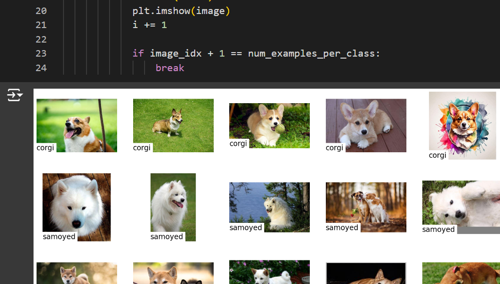
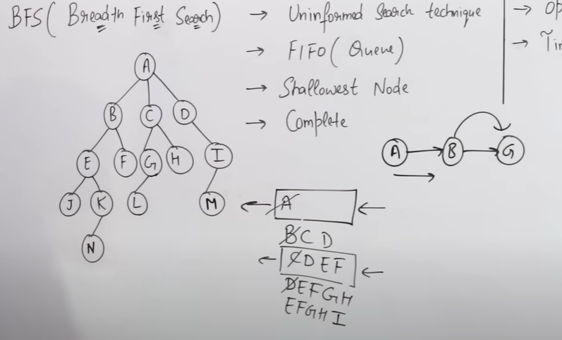
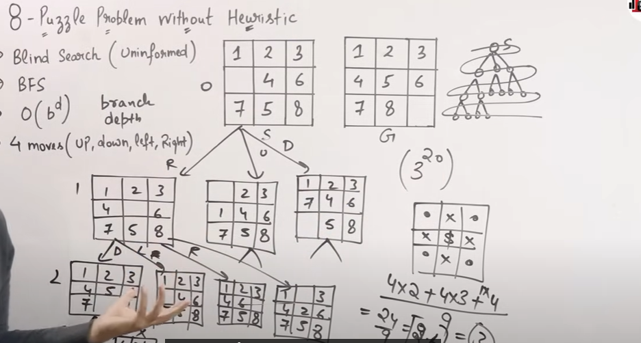
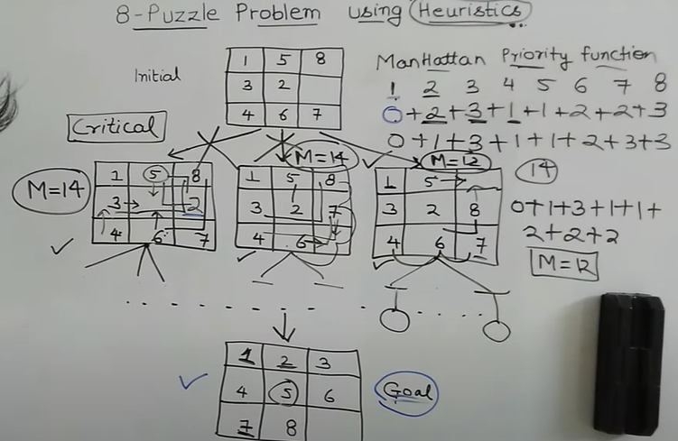
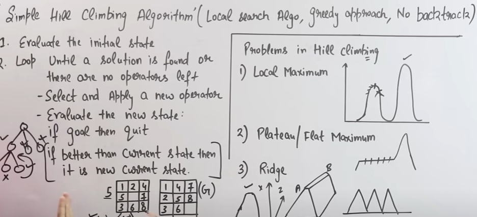
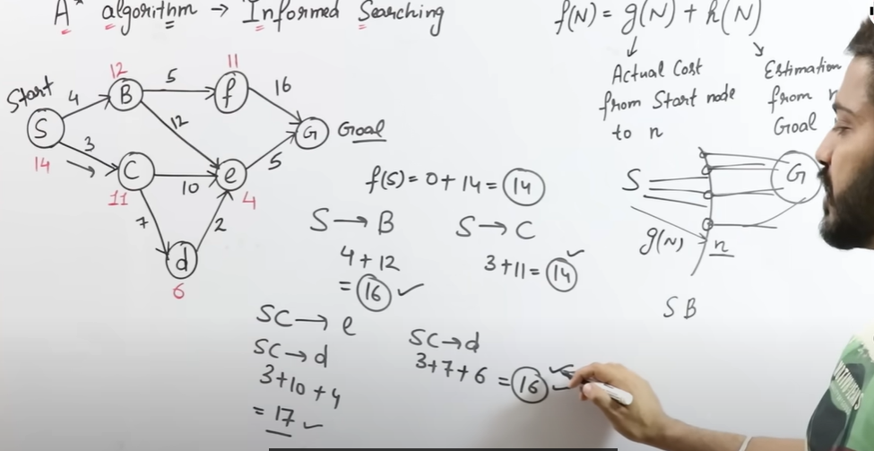
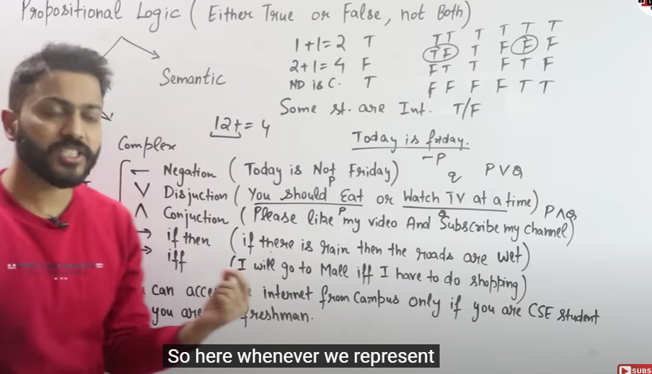

# Questions

A heuristic is admissible if

It always underestimates cost to reach goal
never overestimates the cost to reach the goal from any node.

DFS is space efficient algorith while BFS is time fficient algorithm

Turin gtest is acting humanly

A search algorithm that resembles minimax
alpha beta pruning

__ in AI are entities that act upon an envrieonment using sensors
agents

if b is the branching factior d is depth of resultantn tree O(b^d)

Turing test allows the esaminer to test senosts for examinee
test intelligent behavior

The environement of a chess bot designed to play chessagainst a human opnent is stochastics
 false
deterministic but strategi 

Agent does not need to keep track of deterministic environments

weak ai

which search methods uses stack operation for finfding the states

 depth first search

task environemnt for automated trigger sustem to start/stop the esca

 discrete episodic dynamic fully observable

below search uses heuristic values
 hill climbing

Depth first iterative depening search prefered for large unknown

Artificial intellingence imposes a limit on nodes it processes
 depth limited search

Instrumen to percieve and act
 sensors and actuators

Time complexit of BFS and OFs
 O(V+E)

Which of the following method/methods are Uniformed Search techniques

 Breadth first search

B is the branching factor and m is the maximum depth then time compleity and space complexity os given as

Time colexity O(b^m) soacec complexity O(bm)

Connection between logical reasoning and real environment in which 
 User interface

#Notes

Vaccum world problem

8 puzzle

eight queen problem

missionaries and cannibal

cryptarithematic

remove fice stics

water jub problem

cost of a solution is the sum of arc costs on the solution path number of steps/ state transition

uninformed search and informed search

Breadth first O bd
fisrt in first out
less time more space

Depth first searcg
depth limitedsearch
exponential time linear space

informed search

### coorgi classificaiton side project

https://colab.research.google.com/github/nateraw/huggingpics/blob/main/HuggingPics.ipynb#scrollTo=ABreTsYRoDzy

# Notes from video

https://www.youtube.com/watch?v=_CrEYrcImv0&list=PLxCzCOWd7aiHGhOHV-nwb0HR5US5GFKFI&index=8

# state space search

S (start, goal), Actions, Actions(S), Result(s,a), cost(s,a)
for precision and analyse

Uninformed, informed
O(b^d)

# uninformed and informed search

uninformed
Search without information
no knowledge
time consumeing 
more complexity
DFS, BFS

informed search
with information, heuristing
knowlege
quick complexity
Astar, best first, heuristing DFS

optimality not guarenteed
(n-1)(s-1) nearest nighbhor, using cost

# BFS

FIFO
uninformed
Shallowest node
complete
optimal
time complexity

TIme complexity
TIme complexity O(V + E)
O(b^D) b is btanch factor

# DFS

uninformed
LIFO
Deepest
Non optimal
non complete - if infinite
Time complexity
O(b^d)

# Bidirectional Search techinique

searches from starting to foal and then goal to start
O(B^D/2)
complete in breadth first seach

# 8 puzzle problem wihtout heuristic

branching factor = 3

# Heuristic function

Making assumption to solve the function quickly

NP problem in polynomial time

factors used - 
Eucleadean distance - manhattan distance
number of misplaced tiles for heuristic

# 8 puzzle with heuristic

misplaced tile

# generate and test

Generate all states till we see the actual solution
generate one state
is it solution
if not go to step 1

Good generators uses heuristic and are non redundant

## 8 puzzle with manhattan

https://www.youtube.com/watch?v=LYkbWAQWGro

# Best First Search 

Open, Close, priority ques

loop 
if open is empty return failurs
node <- remove-first (OPEN) if Node is goal then retun path
then generate all nodes
put nodes into open
end loop

# Beam Search algorithm

remove nodes not optimal
beam =2 take best 2 remove all
space cmoplexity

# Hill climbing algorithm
cheks locally 

loop
generate nodes
if nodes is goal then good
if states are usddthen exhausted
else generate all nodes
new state is it better than current stae
put nodes i open
end loop

# A star algorithm

Admissible
informed searching
f(n) = g(n) + h(n)
actual cost from start to n + cost from n to goal

Time = O(V + E) O(b^D)

# AO* algorithm

DOes not eplore all paths if it gets a solution

# knowledge represnetaion and resoning

syntax semantic

logic - proposition, predicate

Rules

semantic net - meaning graph

frame - slots and fillers - object and attribute

script

# propositional logic

atomic and comlex
>>>
negation
disjunction
aconjunction
if then
if and only if

it should only be True or false

F(X) ^ S(x,CSE) -> A(X)

# inference

https://www.youtube.com/watch?v=DZXTVoSQzFo

modus pnene
implicaiton elimination
A -> B
b , A

odus tollent

A -> B
~B
~a

elimination
a and b
a

inroduction

a 
b
-> a and B

or

a
a or B

negation elimination
no (no (a)) -> a

unit resolution

a or b

~a
b

## applynng inference statement

