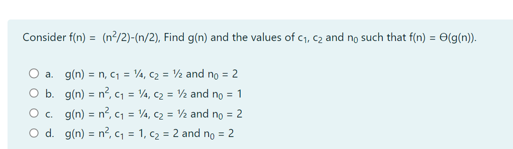
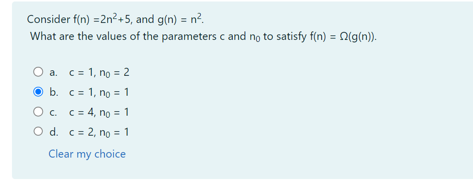
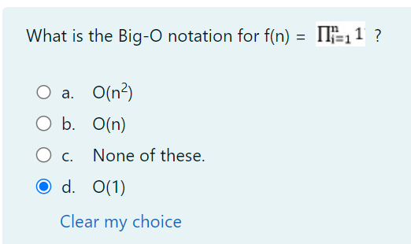
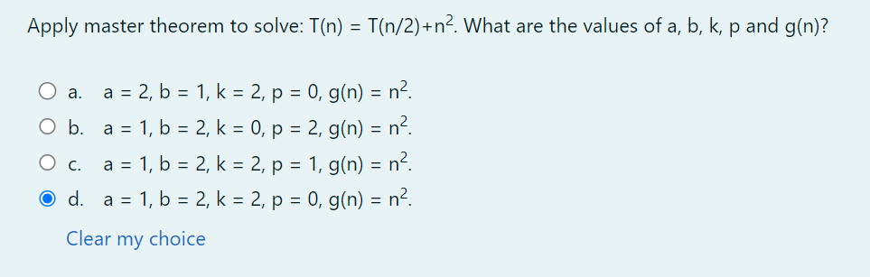
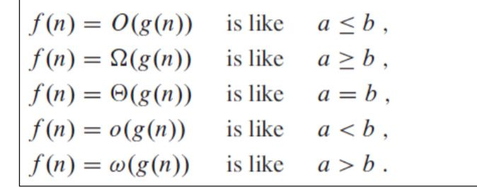

Big o notation for function
O(nlogn)

consider  values of parameters c and n0 staisy f(n) = omega(g(n))
c = 1 n0 = 1

fn = log n and g(n = 1/n then which is correct
f(n) = omega g(n))

how to define correctness of an algorithm
correct after finite amount of tie

Consider a ram model for i < 1 to n-1 do how maniny primitive operation

initialize = 1 condition check = n ncrement = n-1 and assign = n-1

which recurrence relation represents the time complexity

T(n) - a if n=2, = T(root(n) + b where a and b are constant

none of these

fn = pi - o n2 o n2

log i = nlog n

fn = W g(n)

Master therom to solve T(n) = T(n/2) + n2. what are the values of a, b, k, p?
a = 1, b= 2, k=2, p=0

consider fn= 2n2 + 5 gn = n2

Ram modle initialise 1 

T(n) = a (if n=2) = T(n-1) root(n)

Algorithm A(n) T(n) = a(n=2) T(root (n)) + b otherwise wher a and b are constants

# big o  notation

When your calculation is not dependent on the input size, it is a constant time complexity (O(1)).
When the input size is reduced by half, maybe when iterating, handling recursion, or whatsoever, it is a logarithmic time complexity (O(log n)).
When you have a single loop within your algorithm, it is linear time complexity (O(n)).
When you have nested loops within your algorithm, meaning a loop in a loop, it is quadratic time complexity (O(n^2)).
When the growth rate doubles with each addition to the input, it is exponential time complexity (O2^n).

