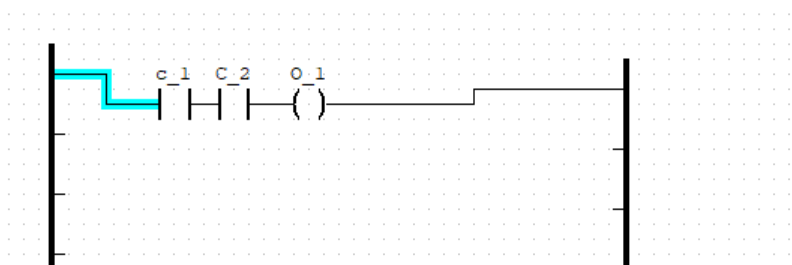
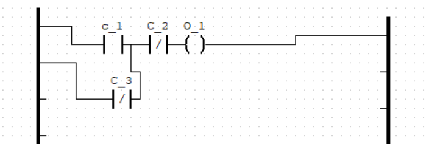
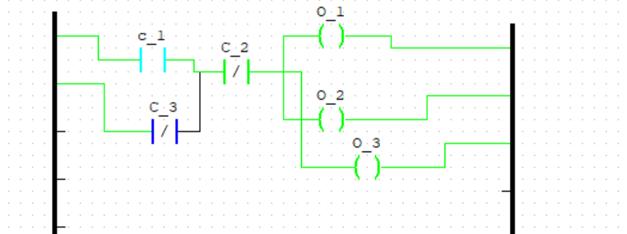
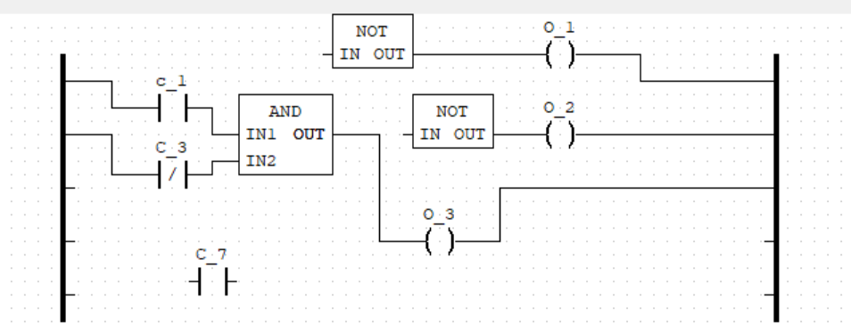
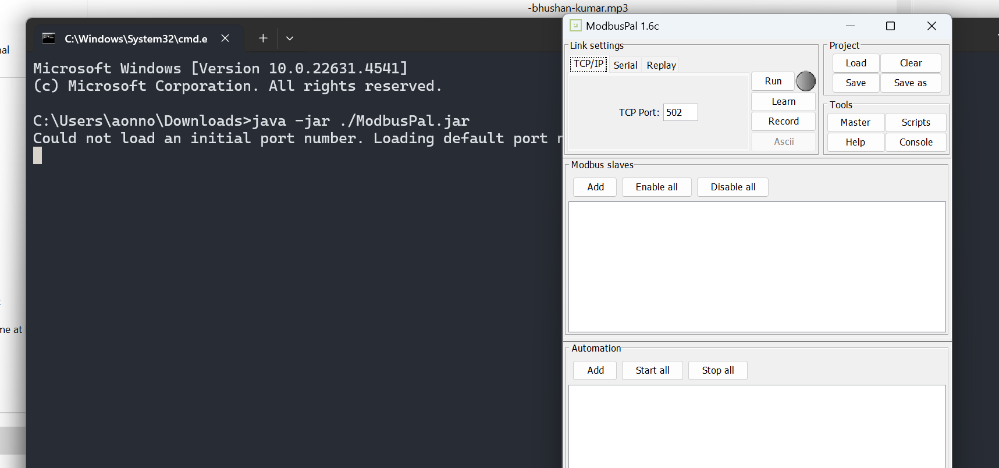

## Siemens 

TIA portal
PLC sim, simulation software

openplc version 3 - opensource alt

Memory area
execution cycle

ob1 - organisational block which runs for 1 cycle and restarts again

openplc making logic and adding a button. 

no and nc contact

most protection logic is created in and and most signals are closed signals nc signals.

ladder logic will require logic to be compiled in tia portal or openplc to be reupload in the system.

exor ladder diagram

ondelay function
offdelay function

Array - upperbound and lowerbound

normalisaiton and scaling

# scenario

scaling can be incorporated

changing logic of variables

flags- opeconvereyer belt

plc logic functions _ 

https://instrumentationtools.com/plc-logic-functions/

power and aviation sector

livefire

3 scenario multiple activities

unity simulation hacking

connect to email address

OPenplc

choose a powerrail

input 

# scada systems

https://www.youtube.com/watch?v=Fd1RLWqIPls

https://www.youtube.com/watch?v=xk-d4Bc0xII

## Sieman's tia PORTAL 

board

6es7 212-1ae40-0x80

v4.4

192.168.0.x - ip adress
192.168.0.254 - dont use

OPen the device
look at the device configuration
Ethernet affresses option we can configure the ip addresses

program bloc
main_ob

172.16.1.168

PLCSIM V19

resource for ld
https://www.geeksforgeeks.org/plc-programming-ladder-logic/

### Assignment

>Switch ON a motor with a Start momentary push button and switch OFF the same motor with a Stop momentary push button.

>Switch ON all 3 motors with a Single Start momentary push button, Switch OFF all with single Stop momentary push button.

>Turn a lamp ON/OFF.
Inputs: Start Momentary P.B. and Stop Momentary P.B.
Outputs:- Lamp.
When start PB is pressed, Lamp should ON and then when stop PB is pressed. Lamp should get off. (Make logic using Binary Bit as holding).

nodered applicaiton

mac adress for plc identifier

opc ua for modbus over ethernet

> Combinations of switches to ON/OFF a lamp. (No holding required)
Inputs:- PB1, PB2
Outputs:- O/P1 Green lamp. O/P2 Blue lamp. O/P3 Red lamp.
a). If PB1 is pressed O/P1 and O/P2 glows.
b). If PB1 and PB2 are pressed simultaneously only O/P3 glows. 
c). If PB2 is pressed only O/P2 should glows.

> Turn a lamp ON/OFF.
Inputs:- I/P1-Start PB1 for pump1, I/P2- Stop PB2 for pump1, I/P3- pump2, I/P4- Stop PB4 for pump2.
Outputs: O/P1:- Green lamp, O/P2:- Red lamp, O/P3:- pump1, O/P4:- pump2.
a). When I/P1 is pressed:- Pump1 starts and Red lamp glows. Then 
b). When I/P3 is pressed:- Pump2 starts, Green lamp is ON and Red lamp gets off. Then
c). When I/P2 is pressed:- Pump1 switches off, Red lamp glows with Green lamp off. Then
d). When I/P4 is pressed:- Pump2 switches off and Red lamp also goes off. (as green lamp was previously off in step3).

ISO and ISA for basic protection of OT 
incidents have ot be recorded

intrusion through remote access
ddos attack

infiltration of malware
HUman error sabotage, espionage

# task

1. create a service paper

Standard for OT security
IEC 62443

NIST2 in EU

# MQTT protcol

MQTT has 

publisher > broker > subscriber

sensor 

mosquito client

mosquitto_pub -h 127.0.0.1 -p 1883 -t "powerplant/flag"

hydra -l mqtt_user -P list.txt mqtt://172.16.1.178:1884

mqtt://172.16.1.178

mqtt://172.16.1.178

>sudo apt-get install mosquitto mosquitto-clients

>└─$ mosquitto_pub -h 192.168.31.200 -p 1883 -t "powerplant/flag" -m system
                                                                                                            
>┌──(kali㉿kali)-[~]
└─$ mosquitto_sub -h 192.168.31.200 -p 1883 -t "#" -v                     
powerplant/on false
powerplant/off true
powerplant/running false
powerplant/on true
powerplant/temperature 75°C
powerplant/pressure 120 psi

# modbus

>java -jar ./ModbusPal.jar

>nmap 192.168.31.24 -vv -A -p 501 -Pn

>msconsole
>search

>use auxilliary/scanner/scada/modbusclient

> SET DATA_REGISTERS 2

Modbus data

1- 255 modbus id

31 slaves to 1 master

each slaves to have a unique id

