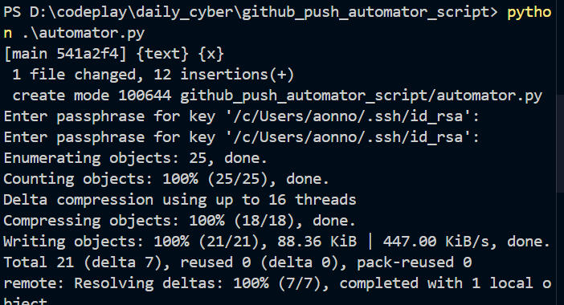

# Github script automator

simple command line utility worked.

## to do

1. make the script global
2. make it so that it accepts arguments
3. make patterns

# commit file now can commit upto a number of days

