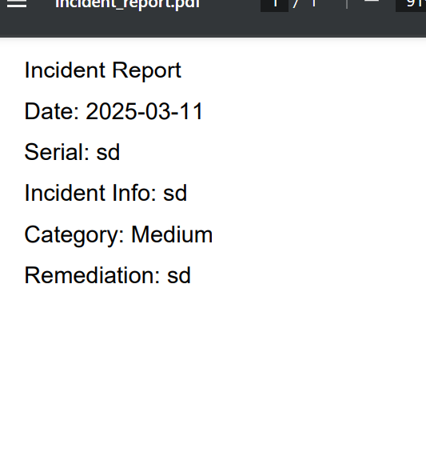

npm start server.js

host index.html

Further refinements.

debug

1. create a new windows for loking at existing reports
2. create login functionality, where each user can add comments of their own,
it should have a route 
3. look at opensource ticketing engines