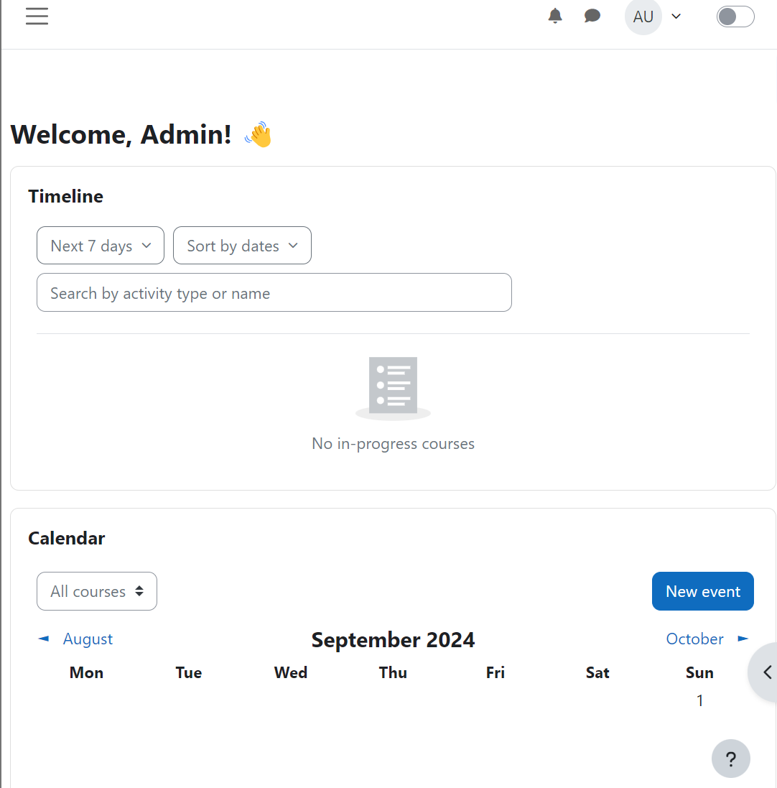
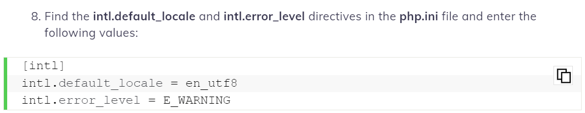

# Tips for installation


Download Xampp

Download moodle and extract it in xamp htdocs folder

## Dealing with error faced during installation

environment.xml - to bypass environemetn check
for mariadb issues

mariadb select always

php.ini for adding extension
followed by taking dll from xampp php into system32

issue with site not opening,

```
go to XAMPP-Cotroll and open Apache->Config->httpd.conf
and add
 
<IfModule mpm_winnt_module>
   ThreadStackSize 8888888
</IfModule>
```



### from hostinger intl php extension

To enable Intl PHP Extension, find the php.ini file in the XAMPP folder on your computer. Using a plain text editor, scroll down and add the following command line to the file: extension=php_intl.dll



Locate extension=intl, extension=openssl, extension=soap, and extension=xmlrpc in the php.ini file. Make sure there are no semicolons coming before them. If they are, simply delete them. Afterward, save changes and close the plain text editor.