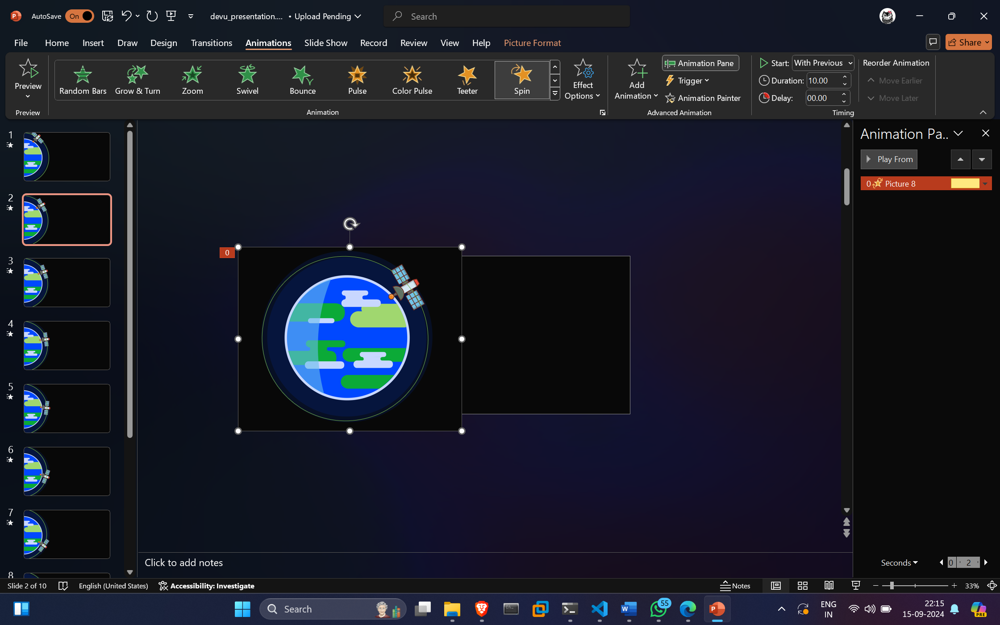

# everything cyber

Need inpiration.

# 14 Oct 2024
 
Poster making for PHD fish conservation.

# 17 Oct

Paper summarisation https://colab.research.google.com/drive/1AkdLoyHMy8LDhtiBznQpvxlnxPCPdUmW#scrollTo=6G8eUSr5tE21

# 05 Nov

Nothing cyber. Recovering from fever.

# 13 Nov

Some random python code
for somethign tictactoe

# 14 Nov

https://colab.research.google.com/drive/1pmm5YEXeDgAduyCK8BhOernUy1TxUfEy#scrollTo=7iH-Cl3tVfuy

Trying to create a BFS A* algorithm.

# 15 Nov

BFS A8 Algorithm but full of bugs

https://colab.research.google.com/drive/1pmm5YEXeDgAduyCK8BhOernUy1TxUfEy#scrollTo=rGFG30zJvvF2

# 16 Nov

BFS questions

# 17 Nov

Nothing of note

# 18 Nov

Finally able to create the node.

# 06 dec

mtech prep

# 09 dec

making a bad attempt at React antive app

# 20 Dec

https://www.youtube.com/watch?v=etjkjZoG2F0

training set with roboflow possible.

learnt that machine intonation is not that good.

# 28 Dec

Will learn basics of react native
is this a new start? 

# 01 Jan

Screenshot extension application