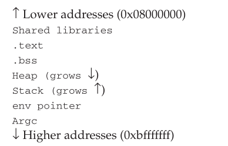

Uses linux/IA32
Easiest to understand

# chapter 1

vulnerability - falw in teh system which can be eploited

exploit - to take advantage of culnerability

process of mapping into memorey
operating system creates an address space for program to run cnotaining instructions and data

Information is loaded from the binary in t address space. There are three types of segments: .text, .bss and .data. The text segment is read only whereas the data and bss are writable. 

data segment contains initialised global vaiables

bss contains uninitialised data - the block starting symbol.

text contains program instruction

then stack and heap are initialized. 
stack is used for transitionary information, like local variables information relating to function calls and other function related stuff
when data is added to stack it grows down the address space.

heap stores the dynamic variables, it grows up in the address space.



assembly - language rules

registers - how registers work 
there are 4 types
general purpose - EAX, EBX, ECX, ESP
segment - CS, DS, SS
control - EIP
other - EFLAGS

dw - define word instruction to define a value for our integer number

lea
repz

```
To match the given assembler code to the C code, we need to interpret the assembly instructions and determine the corresponding C operations. Here’s a detailed breakdown of the assembly code you provided:
Assembly Code Breakdown

    Stack Frame Setup:

    assembly

push %ebp
mov %esp, %ebp
push %edi
push %esi
sub $0x30,%esp

These instructions set up a new stack frame, saving the base pointer and the registers %edi and %esi. The stack pointer is adjusted to allocate local variables.

Memory Initialization:

assembly

lea 0xffffffd8(%ebp), %edi
mov $0x8049508,%esi
cld
mov $0x30,%esp
repz movsl
%ds:( %esi), %es:( %edi)

This section initializes a block of memory. lea calculates the address for %edi (destination), mov loads the source address into %esi, and repz movsl copies a block of data from source to destination. The cld instruction clears the direction flag for string operations.

Load and Calculate:

assembly

mov 0x8(%ebp),%eax
mov %eax,%edx
imul 0xc(%ebp),%edx
mov %edx,%eax
sar $0x1f,%eax
shr $0x1f,%eax
lea (%eax, %edx, 1), %eax
sar %eax
mov %eax,0xffffffd4(%ebp)

These instructions load arguments from the stack, perform integer multiplication, and manipulate the result using arithmetic shifts.

Final Adjustments and Return:

assembly

    mov 0xffffffd4(%ebp),%eax
    mov %eax,%eax
    add $0x30,%esp
    pop %esi
    pop %edi
    pop %ebp
    ret

    The final instructions restore the stack pointer and base pointer, then return from the function.

Matching to C Code

Given the assembly instructions, let’s infer the C code. The critical operation in this assembly is the arithmetic manipulation of the variables. Here's the equivalent C code:

c

int triangle(int a, int b) {
    int result;
    result = (a * b + 0x8000) >> 16;  // This assumes that the shift and addition are used for a rounding effect.
    return result;
}

Explanation

    Function Prologue and Epilogue: The function sets up a stack frame and saves the registers at the beginning. At the end, it restores the stack and registers and returns.

    Memory Initialization: The lea, mov, and repz movsl instructions are for memory initialization, likely setting up space for local variables or initializing data.

    Argument Handling: The mov 0x8(%ebp),%eax and imul 0xc(%ebp),%edx instructions handle the function arguments and perform multiplication. The result is adjusted with arithmetic shifts and then stored in a local variable.

    Arithmetic Manipulation: The multiplication result is adjusted with shifts to effectively divide by 2^16 (which is equivalent to a right shift of 16 bits). This manipulation is similar to fixed-point arithmetic used to approximate floating-point calculations.

The C code provided assumes the function is performing a specific arithmetic operation, which aligns with the observed assembly instructions. The exact nature of triangle might depend on additional context or specific requirements.

```